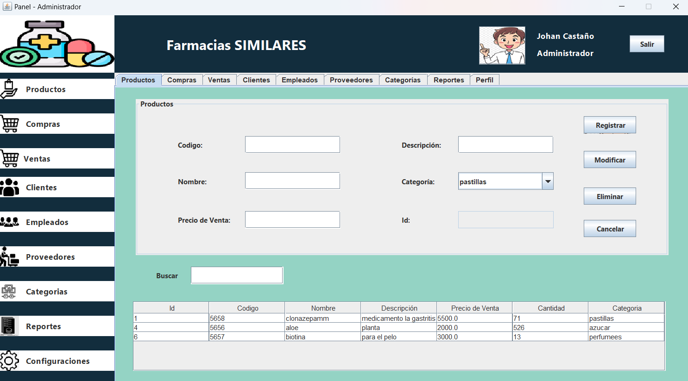
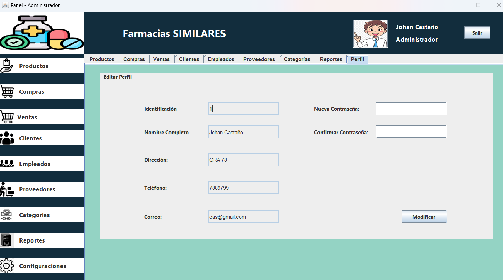

# Sistema de Gestión de Farmacias Similares

Este proyecto es un **Sistema de Gestión de Farmacia** desarrollado en Java utilizando la biblioteca Swing para la interfaz gráfica de usuario (GUI). El sistema sigue el patrón de diseño **MVC (Modelo-Vista-Controlador)** y está respaldado por una base de datos **MySQL** para la gestión de datos.

## Descripción del Proyecto

El sistema permite gestionar de forma eficiente los productos farmacéuticos, ventas, inventarios y proveedores. Está diseñado para facilitar la operación diaria de una farmacia, permitiendo:

- Registrar productos y categorías.
- Controlar el stock y las alertas de inventario bajo.
- Procesar ventas y generar reportes.
- Gestionar la información de los clientes y proveedores.

## Características

- **Interfaz gráfica con Swing**: Diseño amigable e intuitivo que permite una fácil navegación a través de las distintas funcionalidades.
- **Patrón MVC**: Separación de la lógica de negocio, la interfaz de usuario y el control de eventos.
- **Base de datos MySQL**: Sistema robusto para almacenar y gestionar toda la información de la farmacia, incluyendo productos, ventas y clientes.
- **Reportes**: Generación de reportes de ventas y de inventario.
- **Gestión de usuarios**: Control de acceso y permisos para empleados.

## Capturas de Pantalla






## Estructura del Proyecto

```
src/
│
├── controllers/
│
├── models/
│
├── views/
│
```

## Requisitos

- **Java 11 o superior**
- **MySQL 8.0 o superior**
- **conector\mysql-connector-j-9.0.0.jar** para la conexión con MySQL
- **autocompletado\swingx-all-1.6.4.jar** para el autocompletado de las busquedas

## Instalación

1. Clona este repositorio en tu máquina local:

   ```bash
   git clone https://github.com/usuario/sistema-farmacia.git
   ```

2. Configura la base de datos en MySQL:

   - Crea una base de datos llamada `farmacia`.
   - Ejecuta el archivo SQL proporcionado en el directorio `db` para crear las tablas necesarias.

   ```sql
   CREATE DATABASE farmacia;
   USE farmacia;
   -- Ejecuta el script SQL
   ```

3. Configura el archivo de conexión a la base de datos `ConexionBD.java`:

   ```java
   private static final String URL = "jdbc:mysql://localhost:3306/farmacia";
   private static final String USER = "tu_usuario";
   private static final String PASSWORD = "tu_contraseña";
   ```

4. Ejecuta el proyecto desde tu IDE o compilando directamente con:

   ```bash
   javac -d bin -sourcepath src src/main/main.java
   java -cp bin main
   ```

## Uso

Una vez configurado el sistema, puedes acceder a las funcionalidades principales desde la **pantalla principal** donde se encuentran opciones como:

- **Gestión de productos**: Registrar, modificar y eliminar productos.
- **Control de ventas**: Procesar compras-ventas y gestionar clientes.
- **Reportes**: Generación de informes de compras.

## Contribución

Las contribuciones son bienvenidas. Puedes enviar un **pull request** o reportar problemas en la sección de **issues**.

## Licencia

Este proyecto puede ser usado bajo la Licencia Creative Commons.

